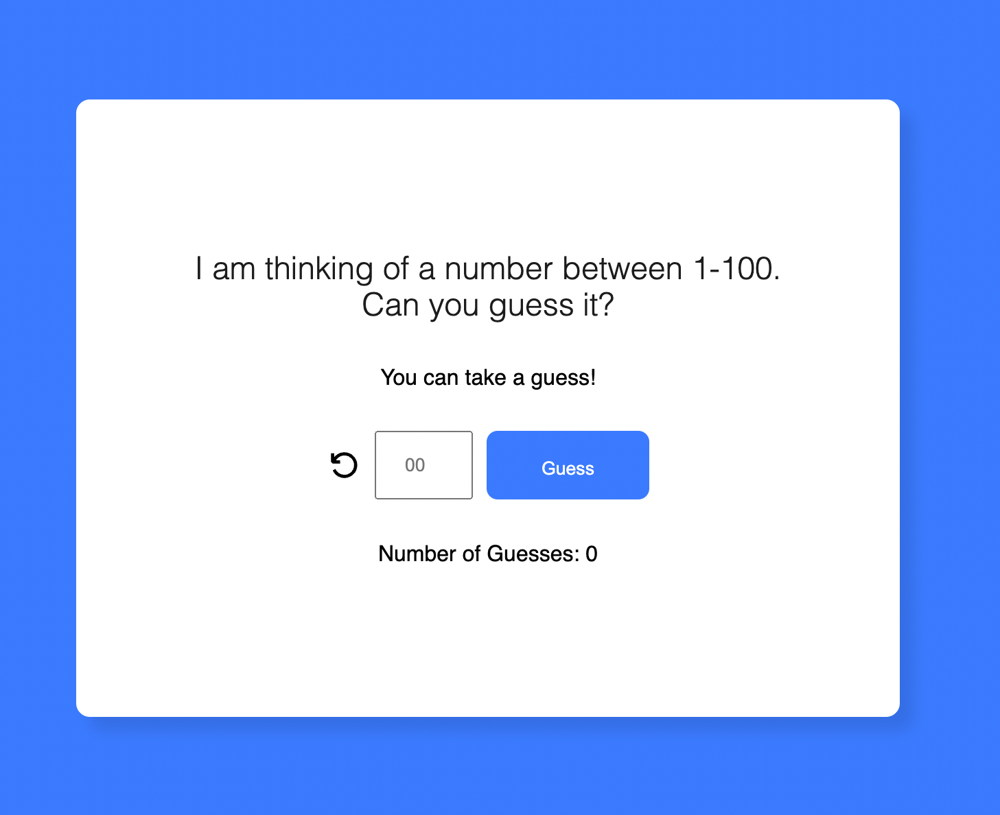

# Guess The Number Game
> A simple guess the number game, made in React. 
## Preview 


## Demo 
You can find the live demo here: 
[https://guess-the-number-gb.netlify.app/](https://guess-the-number-gb.netlify.app/)


## How To Use

### Localy 
To clone and use this application localy. You'll need [Git](https://git-scm.com/downloads) and [NodeJs](https://nodejs.org/en/download/package-manager) (Which comes with NPM) installed on your computer.

From your command line: 

```
// Clone this repository 
$ git clone https://github.com/GazdagB/guess-the-number.git

// Go into the repository 
$ cd guess-the-number

// Install Dependencies
$ npm install 

// Run the app 
$ npm run dev 
```


